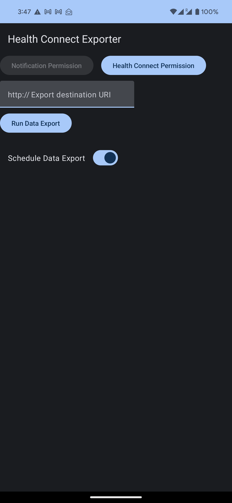

# Health Connect Exports

Export and own your personal health data

A small android app that allows you to export your personal health data from the Health Connect
environment app on your Android phone. The app will group your data export your data into a JSON
format and ping a specified HTTP server with the data.

As of writing this, I'm not planning to make this app "proper", i.e, making better UI / UX choices,
allowing for flexibility, supporting for other Health Connect data points, supporting other data
export method, etc.

Though, if you feel like this would greatly help you, by all means, open an issue and mention what
you want / need from the app and I'll see what I can do.

Contributions are welcome, though not expected and not guaranteed to be merged; this is a personal
project after all, but things might change with time.